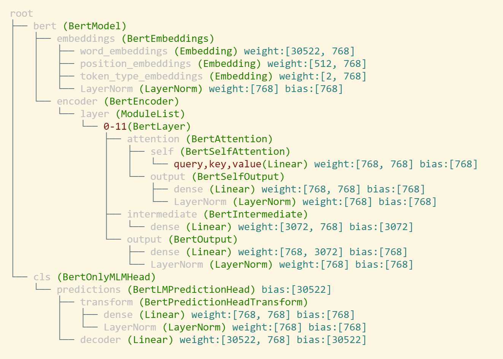

# BigModelVis


A Tool to Visualize Big Models.

## Overview

You can use this tool to visualize the tree structure of big models, with the name/shape of each layer showing in indents.

- A demo picture of using BigModelVis to show the structure of Bert (bert-base-uncased)



## Installation

install the latest pip version

```
pip install bigmodelvis
```

**or** build from source

```
[TODO] add the git address
git clone xxx
cd bigmodelvis
python setup.py install
```


## Usage

```
from bigmodelvis import Visualization
from transformers import BertForMaskedLM
model = BertForMaskedLM.from_pretrained('bert-base-uncased')
visobj = Visualization(model)
visobj.structure_graph()
```

